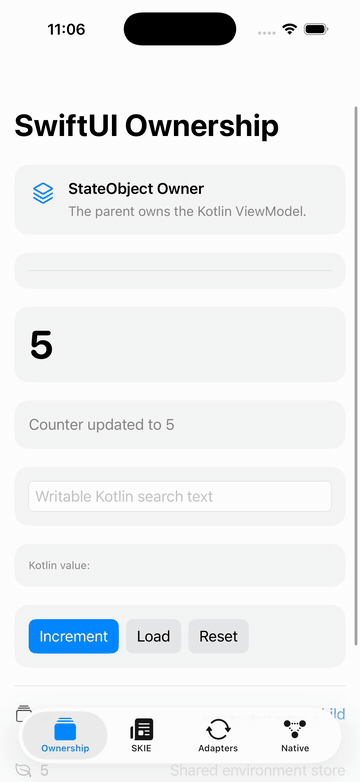
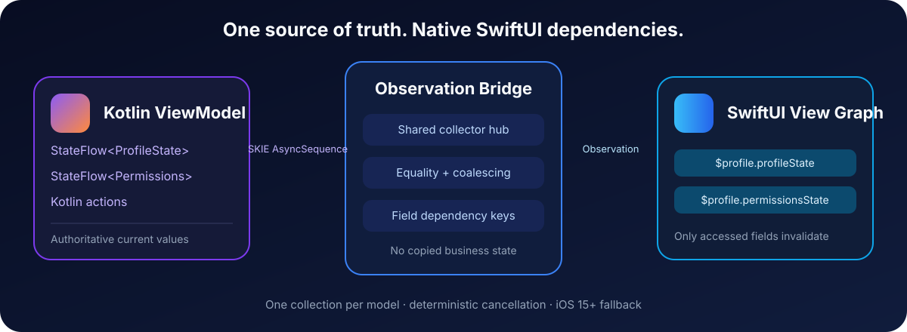
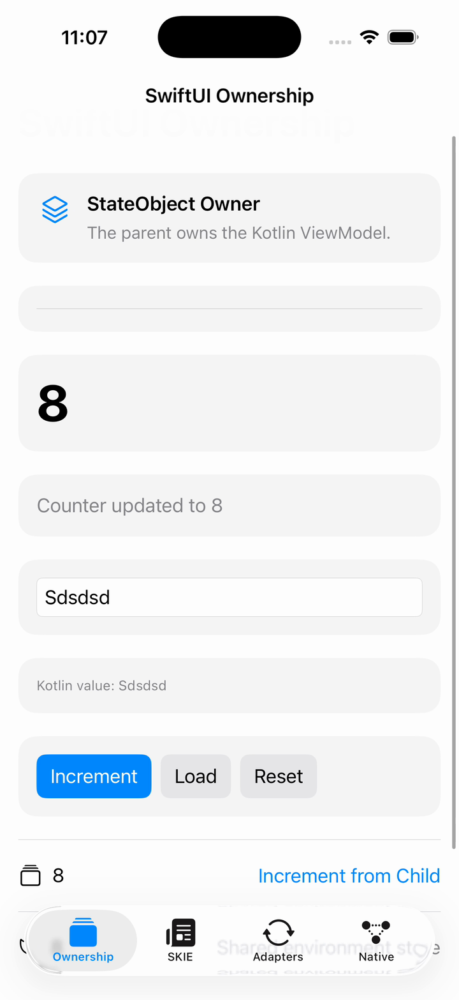

<div align="center">

# KMPObservableBridge

### Kotlin state. Native SwiftUI.

A Swift-first, lifecycle-safe observation bridge for Kotlin Multiplatform
ViewModels, SKIE, KMP-NativeCoroutines, and SwiftUI.


[](https://swift.org)
[](#requirements)
[](https://github.com/sonmbol/KMPObservableBridge/actions/workflows/swift.yml)
[](LICENSE)

</div>

```swift
@KMPStateObject private var profile = ProfileViewModel()

var body: some View {
    ProfileContent(
        state: $profile.profileState,
        searchText: $profile.searchText,
        retry: profile.retry
    )
}
```

No shadow Swift ViewModel. No copied business state. No runtime reflection,
swizzling, selector discovery, or generated source file.

**Evaluate it in five minutes:** [install the package](#quick-start), explore the
[DailyPulse app](Examples/DailyPulse/iosApp), or read
[when to choose this bridge](Docs/Evaluating-KMPObservableBridge.md).

## Why KMPObservableBridge?

Kotlin remains the authoritative source of truth while SwiftUI receives native
values, bindings, ownership semantics, and precise dependencies.

| Capability | Behavior |
| --- | --- |
| Native ownership | `@KMPStateObject`, `@KMPObservedObject`, and `@KMPEnvironmentObject` mirror SwiftUI’s ownership language |
| Field-level dependencies | On iOS 17+, only views that read an emitted projected field are invalidated |
| Shared collection | Macro-configured wrappers share one static collector set per Kotlin model |
| Native projection | `$viewModel.state` returns the current Swift value without exposing `.value` |
| Safe bindings | Writable Kotlin exports produce `Binding`; read-only StateFlows remain read-only |
| Deterministic lifetime | Collection, callback, Combine, and NativeFlow cancellation follow SwiftUI identity storage |
| Exporter isolation | SKIE and NativeCoroutines APIs live in separate package products |
| Compile-time configuration | Macros validate imported ViewModel types and state key paths |

<p align="center">
  
</p>

## Architecture

<p align="center">
  
</p>

The bridge never stores a second copy of emitted business state:

1. Kotlin `StateFlow` owns the current value.
2. SKIE exposes synchronous value access and an `AsyncSequence`.
3. A weak per-model registry shares one observation hub across wrappers.
4. Equality filtering rejects consecutive duplicates.
5. Coalescing unions all dependencies changed in the same main-actor turn.
6. SwiftUI reevaluates views that read the affected projected field.

Direct model consumers intentionally receive global invalidation. Custom
adapters without a key path also invalidate globally because the affected
field cannot be identified safely.

## Quick start

### 1. Add the package

Add this repository through Xcode’s **Package Dependencies** interface:

```text
https://github.com/sonmbol/KMPObservableBridge.git
```

Link exactly one primary integration product:

| Project setup | Product |
| --- | --- |
| SKIE StateFlow | `KMPObservableBridgeSKIE` |
| KMP-NativeCoroutines | `KMPObservableBridgeNative` |
| Callbacks, Combine, or custom adapters | `KMPObservableBridge` |

The core and Native products do not expose SKIE symbols.

### 2. Enable native value projection

Declare this once in the application module when using SKIE:

```swift
import shared
import KMPObservableBridgeSKIE

extension SkieSwiftStateFlow: @retroactive KMPValueProperty {}
```

### 3. Enable observation

For the smallest setup, attach the macro without arguments:

```swift
@KMPObservable
extension ProfileViewModel: @retroactive KMPStaticallyObservable {}
```

Fields are discovered on demand when they are read through the projected
store, for example `$profile.profileState`. Swift supplies the typed key path
to the dynamic-member subscript at compile time; the bridge does not use
reflection or inspect the imported Kotlin declaration. The first read starts
one shared collector for that field, and unread fields allocate no collector.

For eager observation, list the fields explicitly:

```swift
@KMPObservable(
    ProfileViewModel.self,
    fields: \.profileState, \.permissionsState
)
extension ProfileViewModel: @retroactive KMPStaticallyObservable {}
```

The fields are ordinary Swift key paths. Renaming a Kotlin export or selecting
an incompatible property fails at compile time.

Swift macros cannot enumerate members of imported Kotlin classes. The
argument-free form solves that limitation through compile-time key paths at
each projected read; the explicit form remains available when observation must
begin before a field is read. Both forms avoid runtime reflection and
build-generated Swift files.

### 4. Use native ownership

Own the ViewModel for one SwiftUI identity:

```swift
struct ProfileScreen: View {
    @KMPStateObject(
        wrappedValue: ProfileViewModel(),
        dispose: { $0.clear() }
    )
    private var profile

    var body: some View {
        ProfileContent(viewModel: profile)
    }
}
```

Observe a model owned elsewhere:

```swift
struct ProfileContent: View {
    @KMPObservedObject private var profile: ProfileViewModel

    init(viewModel: ProfileViewModel) {
        _profile = KMPObservedObject(viewModel)
    }

    var body: some View {
        Text($profile.profileState.title)
    }
}
```

Inject the same store through the environment without creating another
subscription:

```swift
ProfileContent()
    .kmpEnvironmentObject($profile)

struct ProfileContent: View {
    @KMPEnvironmentObject private var profile: ProfileViewModel
}
```

## Native values and bindings

The unprojected property remains the original Kotlin object. Use it for
actions:

```swift
profile.retry()
profile.selectArticle(id: article.id)
```

The projected store returns native current values:

```swift
Text($profile.messageState)                 // String
ProgressView(value: $profile.progressState) // Double

if $profile.loadingState {                  // Bool
    ProgressView()
}
```

A writable Kotlin export produces a native binding:

```swift
TextField("Search", text: $profile.searchText)
```

A read-only StateFlow cannot form a `WritableKeyPath`, so an unsafe binding
cannot compile. Change immutable state through Kotlin actions.

```swift
profile.retry()              // Kotlin action
$profile.messageState        // String
$profile.loadingState        // Bool
$profile.countState          // Int
$profile.searchText          // Binding<String>
$profile.rawModel            // Original Kotlin object
```

## Explicit adapters

Macros are optional when observation is configured at the wrapper:

```swift
@KMPStateObject(state: \.profileState)
private var profile = ProfileViewModel()

@KMPObservedObject(
    profile,
    states: \.profileState, \.permissionsState
)
private var profile
```

`KMPState` supports:

- SKIE `AsyncSequence` and `StateFlow`
- KMP-NativeCoroutines `NativeFlow`
- Combine publishers
- Callback APIs with explicit cancellation
- Custom adapters
- Equatable projections for measured hot paths

```swift
@KMPObservedObject(
    profile,
    state: \.profileState,
    changes: .field(\.isLoading)
)
private var profile
```

## Rendering and lifecycle guarantees

### SwiftUI identity

`@KMPStateObject` stores its coordinator in SwiftUI identity storage. Moving
or conditionally replacing the view follows normal `StateObject` lifetime
rules. Visual `onDisappear` is not treated as destruction.

### Collection sharing

All wrappers observing the same model identity lease the same hub. The final
lease cancels its underlying collectors.

### Rebinding

An externally owned wrapper cancels its old lease before observing a new
model. Generation tokens suppress emissions racing from the previous model.

### Main actor

SKIE collection, equality validation, dependency delivery, coalescing, and
SwiftUI invalidation remain on `MainActor`. Foreign callbacks cross actors
once before entering the bridge.

### Platform behavior

| Platform generation | Invalidation model |
| --- | --- |
| iOS 17+, macOS 14+, tvOS 17+, watchOS 10+ | Lazy field-level Observation dependencies |
| Earlier supported systems | Correct `ObservableObject.objectWillChange` fallback |

## Update policies

`.coalesced` is the default. It schedules at most one flush per main-actor turn
while preserving every changed dependency:

```swift
@KMPStateObject private var profile = ProfileViewModel()
```

Event-sensitive consumers can request every accepted emission:

```swift
@KMPStateObject(updatePolicy: .immediate)
private var profile = ProfileViewModel()
```

Immediate mode does not allocate a dependency set per emission.

## Examples and previews

The [DailyPulse example](Examples/DailyPulse/iosApp) contains:

- Macro-declared SKIE StateFlow observation
- `StateObject`, `ObservedObject`, and environment ownership
- Native writable bindings
- KMP-NativeCoroutines
- Callback cancellation
- Combine publisher observation
- Injector-owned ViewModels
- Loading, error, empty, populated, and dark-mode previews

<p align="center">
  
</p>

Every example uses a thin live bridge container around a pure SwiftUI
presentation view:

```text
KMP ViewModel
    ↓ thin observation container
Native Swift values + Binding + action closures
    ↓
Pure SwiftUI presentation
```

Preview fixtures contain only Swift values. They do not initialize Koin,
allocate Kotlin ViewModels, start coroutines, collect flows, or perform network
work.

## Performance

Reference measurements are committed in
[Benchmarks/RESULTS.md](Benchmarks/RESULTS.md). On the documented M3 Pro
release-build run:

| Scenario | Work | Mean |
| --- | ---: | ---: |
| Immediate delivery | 10,000 emissions | ~0.007 s |
| Store lifecycle | 1,000 create/teardown cycles | ~0.005 s |
| Shared static setup | 1,000 setup/teardown cycles | ~0.007 s |

These are local reference measurements, not universal performance claims.
Run the suite on target hardware before setting capacity thresholds.

## Requirements

- Swift 5.9+
- iOS 15+
- macOS 11+
- tvOS 14+
- watchOS 7+
- An exported asynchronous state source, such as SKIE or
  KMP-NativeCoroutines

Toolchain-specific package manifests select matching SwiftSyntax versions:

| Swift | SwiftSyntax |
| --- | --- |
| 5.9 | 509 |
| 6.0 | 600 |
| 6.1 | 601 |
| 6.2 | 602 |

All manifests expose the same products and public API.

## Validation

Release validation covers:

- Unit, lifecycle, cancellation, macro, and dependency-granularity tests
- Strict concurrency with warnings as errors
- Public API compatibility against `1.1.0`
- Swift 5.9–6.2 toolchain builds
- iOS device and Apple simulator builds
- SKIE/native symbol-isolation audit
- Real Gradle → SKIE → macro → Xcode application build
- Documentation and whitespace checks

Run the primary checks locally:

```sh
swift test
swift test \
  -Xswiftc -strict-concurrency=complete \
  -Xswiftc -warnings-as-errors
./Scripts/check-api.sh
./Scripts/check-package-manifests.sh
```

The Apple-platform
[SwiftUI hosting smoke tests](Documentation/SwiftUIHostingTests.md) document
their Xcode requirement, simulator destinations, runtime fallback coverage,
render-count probes, and teardown contract.

Build the real integration fixture without forcing the macro target onto the
iOS SDK:

```sh
xcodebuild build \
  -project Examples/DailyPulse/iosApp/iosApp.xcodeproj \
  -scheme iosApp \
  -destination 'generic/platform=iOS Simulator'
```

## Documentation

- [DailyPulse integration guide](Examples/DailyPulse/iosApp/README.md)
- [DocC catalog](Sources/KMPObservableBridge/Documentation/KMPObservableBridge.docc/KMPObservableBridge.md)
- [Benchmark methodology](Benchmarks/RESULTS.md)
- [Evaluation, comparison, and migration guide](Docs/Evaluating-KMPObservableBridge.md)
- [Adoption playbook](ADOPTION.md)
- [Contributing](CONTRIBUTING.md)
- [Architecture discussion](https://github.com/sonmbol/KMPObservableBridge/discussions/16)
- [Issue tracker](https://github.com/sonmbol/KMPObservableBridge/issues)

## License

KMPObservableBridge is available under the [MIT License](LICENSE).

---

<div align="center">

Built for Kotlin Multiplatform teams that want SwiftUI to remain SwiftUI.

</div>
