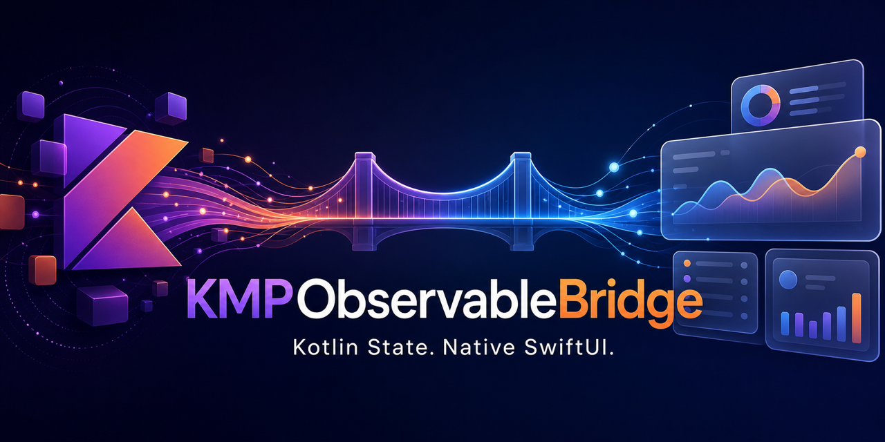

# KMPObservableBridge



[](https://swift.org)
[](https://kotlinlang.org/docs/multiplatform.html)
[](Package.swift)
[](LICENSE)

`KMPObservableBridge` lets SwiftUI observe Kotlin Multiplatform ViewModels
without writing a Swift wrapper for every screen. Kotlin remains the source of
truth, and SwiftUI continues calling the real Kotlin ViewModel directly.

**SwiftUI-native KMP state observation for StateFlow, SKIE,
KMP-NativeCoroutines, Combine, callbacks, and custom coroutine adapters.**

The core has no Kotlin-side component, superclass, annotation, compiler plugin,
or third-party runtime dependency. Explicit state key paths are intentional:
arbitrary generated KMP streams cannot be discovered reliably through Swift or
Objective-C reflection without framework-specific metadata.

Keywords: SwiftUI, Kotlin Multiplatform, KMP, KMM, StateFlow, coroutines,
Kotlin/Native, iOS, SKIE, KMP-NativeCoroutines, ObservableObject, Observation,
MVVM, MVI.

## The common case

Most screens need one immutable Kotlin `StateFlow`. With SKIE, setup takes
three steps.

### 1. Expose one screen state from Kotlin

```kotlin
data class ProfileState(
    val profile: Profile? = null,
    val isLoading: Boolean = false,
    val error: ProfileError? = null,
)

class ProfileViewModel(
    private val repository: ProfileRepository,
) {
    private val scope = CoroutineScope(SupervisorJob() + Dispatchers.Default)
    private val _state = MutableStateFlow(ProfileState())
    val state: StateFlow<ProfileState> = _state.asStateFlow()

    fun refresh() {
        scope.launch {
            _state.update { it.copy(isLoading = true, error = null) }
            _state.value = runCatching { repository.profile() }.fold(
                onSuccess = { ProfileState(profile = it) },
                onFailure = {
                    ProfileState(error = ProfileError.from(it))
                },
            )
        }
    }

    fun clear() {
        scope.cancel()
    }
}
```

Loading, content, empty, and domain-error states should live together in this
immutable state object.

### 2. Add the SKIE conformance once

Place this in the iOS application target:

```swift
import shared
import KMPObservableBridge

extension SkieSwiftStateFlow: @retroactive KMPValueProperty {}
```

This only adds convenient nested reads. It does not copy or take ownership of
the Kotlin state.

### 3. Own and observe the ViewModel

```swift
struct ProfileScreen: View {
    @KMPStateObject(
        wrappedValue: ProfileViewModel(repository: Dependencies.profile),
        state: \.state,
        dispose: { $0.clear() }
    )
    private var viewModel

    var body: some View {
        Group {
            if viewModel.state.isLoading {
                ProgressView()
            } else if let error = viewModel.state.error {
                ErrorView(error: error, retry: viewModel.refresh)
            } else if let profile = viewModel.state.profile {
                ProfileContent(profile: profile)
            } else {
                EmptyView()
            }
        }
        .task {
            viewModel.refresh()
        }
    }
}
```

There is no Swift adapter object and no duplicated `@Published` state.
The default `.coalesced` update policy avoids redundant redraws when several
flows emit in the same main-actor turn.

## Installation

### Xcode

1. Select **File → Add Package Dependencies…**
2. Enter `https://github.com/sonmbol/KMPObservableBridge.git`.
3. Choose **Up to Next Major Version** from `1.0.0`.
4. Add the `KMPObservableBridge` product to your application target.

Then add `import KMPObservableBridge` to your SwiftUI view.

### Package.swift

```swift
dependencies: [
    .package(
        url: "https://github.com/sonmbol/KMPObservableBridge.git",
        from: "1.0.0"
    ),
],
targets: [
    .target(
        name: "YourApp",
        dependencies: [
            .product(
                name: "KMPObservableBridge",
                package: "KMPObservableBridge"
            ),
        ]
    ),
]
```

The package supports:

- iOS 14+
- macOS 11+
- tvOS 14+
- watchOS 7+
- Swift tools 5.9+

## Which property wrapper should I use?

| Situation | Wrapper | Disposes Kotlin model? |
| --- | --- | --- |
| The view creates the ViewModel | `KMPStateObject` | Only when `dispose` is supplied |
| A parent or DI container owns it | `KMPObservedObject` | Never |
| An ancestor injects `$viewModel` | `KMPEnvironmentObject` | Never |
| A parent owns a child ViewModel | `KMPChildObject` | Never |

### View-owned model

```swift
@KMPStateObject(
    wrappedValue: ProfileViewModel(),
    state: \.state,
    dispose: { $0.clear() }
)
private var profile
```

The model is created lazily and once per SwiftUI view identity.

### Injector-owned model

```swift
@KMPStateObject(
    injector: AppInjector(),
    viewModel: \.profileViewModel,
    state: \.state,
    dispose: { $0.clear() }
)
private var profile
```

### Parent-owned model

```swift
struct ProfileContent: View {
    @KMPObservedObject private var profile: ProfileViewModel

    init(viewModel: ProfileViewModel) {
        _profile = KMPObservedObject(viewModel, state: \.state)
    }

    var body: some View {
        Text(profile.state.profile?.name ?? "No profile")
    }
}
```

If the parent supplies a different ViewModel instance, the bridge cancels the
old observation and safely rebinds. It never calls `clear()` on a parent-owned
model.

## Reading state and calling Kotlin

The wrapped value is the real Kotlin ViewModel:

```swift
viewModel.refresh()
viewModel.selectItem(id: item.id)
```

With `KMPValueProperty`, nested state members omit `.value`:

```swift
viewModel.state.isLoading
viewModel.state.profile
```

The flow itself is still returned when assigning the whole property:

```swift
let flow = viewModel.state
let currentState = viewModel.state.value
```

Swift cannot replace only one property on the Kotlin object while preserving
all of its other methods. `KMPValueProperty` is therefore dynamic-member syntax,
not flow flattening.

## Multiple state streams

Prefer one screen-level state object. When a ViewModel genuinely exposes
multiple independent streams, use the advanced `states:` initializer:

```swift
@KMPStateObject(
    wrappedValue: DashboardViewModel(),
    states: \.contentState, \.connectionState,
    dispose: { $0.clear() }
)
private var dashboard
```

Direct key-path syntax supports any number of heterogeneous streams:

```swift
states: \.content, \.connection, \.permissions, \.syncProgress, \.selection
```

Every emission invalidates the view. Avoid observing streams the view does not
render, especially high-frequency streams. When mixing source kinds or building
a dynamic collection, use the type-erased advanced form:

```swift
adapters:
    .asyncSequence(\.contentState),
    .callback { viewModel, notify, reportError in /* ... */ },
    .publisher { $0.connectionPublisher }
```

## Observation errors versus domain errors

Domain failures—network rejection, validation, authorization, empty results—
belong in Kotlin screen state. Observation failures mean the bridge mechanism
itself failed, such as a throwing Swift adapter:

```swift
@KMPStateObject(
    wrappedValue: ProfileViewModel(),
    state: \.state,
    failurePolicy: .custom { error in
        logger.error("KMP observation failed: \(error)")
    },
    dispose: { $0.clear() }
)
private var profile
```

Cancellation caused by view teardown is expected and is not reported as an
error.

## Lifecycle and disposal

Observation cancellation and ViewModel disposal are different operations:

- Both wrappers automatically cancel their Swift observation.
- `KMPStateObject` optionally invokes `dispose` exactly once.
- `KMPObservedObject` never disposes an externally owned model.
- Kotlin `clear()` should be idempotent; cancelling a `Job` or
  `CoroutineScope` already is.

If another framework owns the Kotlin lifecycle, omit `dispose`.

To remove disposal boilerplate, conform a generated Kotlin base class once:

```swift
extension BaseViewModel: @retroactive KMPDisposable {
    public func dispose() {
        clear()
    }
}
```

All owned conforming subclasses are disposed automatically. An explicit
`dispose` closure takes precedence.

## Environment ViewModels

Inject the existing projected store rather than the raw Kotlin model:

```swift
struct AppRoot: View {
    @KMPStateObject(wrappedValue: SessionViewModel(), state: \.state)
    private var session

    var body: some View {
        HomeView()
            .kmpEnvironmentObject($session)
    }
}

struct HomeView: View {
    @KMPEnvironmentObject private var session: SessionViewModel
}
```

The environment and owner share one store and one set of subscriptions.
Missing stores produce SwiftUI's normal missing-environment-object failure.

## Child ViewModels

For a direct parent-owned child:

```swift
@KMPChildObject(
    parent: parent,
    child: \.detailsViewModel,
    state: \.state
)
private var details
```

For an optional child emitted by a flow conforming to `KMPValueProperty`:

```swift
@KMPOptionalChildObject(
    parent: parent,
    child: \.activeDetails,
    state: \.state
)
private var details
```

Child identity changes cancel old subscriptions before rebinding. The parent
retains lifecycle ownership, so child wrappers never call `dispose()`.

## Update policy

`.coalesced` is the default and emits at most once per main-actor turn:

```swift
state: \.state,
updatePolicy: .coalesced
```

Use `.immediate` when every emission must produce a distinct invalidation:

```swift
state: \.state,
updatePolicy: .immediate
```

## Interoperability options

The convenience `state: \.state` initializer accepts any `AsyncSequence`, not
only SKIE.

### KMP-NativeCoroutines

For `@NativeCoroutinesState`, observe the generated flow and read its separate
current-value property:

```swift
@KMPStateObject(
    wrappedValue: ProfileViewModel(),
    state: \.profileStateFlow
)
private var profile

let state = profile.profileState
```

If the sequence is produced by a helper:

```swift
adapters: .asyncSequence { viewModel in
    asyncSequence(for: viewModel.profileStateNative)
}
```

### Callback or CFlow adapters

```swift
adapters: .callback { viewModel, notify, reportError in
    let handle = viewModel.state.watch(
        onValue: { _ in notify() },
        onError: { error in reportError(error) }
    )

    return KMPObservation {
        handle.close()
    }
}
```

`notify` and `reportError` may be called from any thread. The bridge delivers
SwiftUI invalidation and error handling on the main actor. Cancellation handles
must release their Kotlin callback.

### Combine

```swift
adapters: .publisher { viewModel in
    viewModel.profilePublisher
}
```

Publisher values invalidate SwiftUI. Publisher failures follow
`failurePolicy`.

### Custom adapters

Use `.custom` only when the async-sequence, callback, and publisher factories
cannot represent the integration. It has the same
`(viewModel, notify, reportError) -> KMPObservation` contract as `.callback`.

## Threading and memory guarantees

- SwiftUI invalidation always occurs on the main actor.
- Observation is used automatically on current Apple platforms, with
  `ObservableObject` fallback on older deployment targets.
- Callback notification closures are sendable and safe to invoke from worker
  threads.
- Cancellation is synchronous, main-actor isolated, and idempotent.
- Rebinding suppresses emissions already queued by the previous model.
- Observation closures hold the Swift coordinator weakly.
- Async tasks and Combine subscriptions are cancelled when observation ends.
- The bridge stores no shadow copy of Kotlin state.

An `AsyncSequence` implementation must still cooperate with task cancellation.
A custom callback adapter must close its own handle.

## Migration from the pre-1.0 API

- For one stream, replace
  `states: .asyncSequence(\.state)` with `state: \.state`.
- For any number of async streams, use
  `states: \.firstState, \.secondState`.
- Replace mixed `states: .callback(...)` declarations with
  `adapters: .callback(...)`.
- Replace `onObservationError` with
  `failurePolicy: .custom { error in ... }`.
- Replace removed `.property(\.state)` and `.flow(\.state)` calls with
  `.asyncSequence(\.state)`.
- Remove old `value:` and `as:` arguments; those overloads never stored a Swift
  value.
- Callback and custom adapters receive
  `(viewModel, notify, reportError)`.
- ViewModel types must be reference types so identity changes can be handled
  safely.

## Testing

The package test suite covers:

- Async-sequence emission, completion, failure, and cancellation
- Background callback delivery
- Combine emission and failure
- Idempotent cancellation and automatic token cleanup
- Model rebinding and stale-emission suppression
- Model/coordinator deallocation
- Owned-model disposal
- High-frequency observation
- Parameter-pack state lists and update coalescing
- Environment projection and direct/optional child models
- Modern Observation and legacy `ObservableObject` paths
- Swift strict-concurrency diagnostics

Run:

```shell
swift test
swift test -Xswiftc -strict-concurrency=complete -Xswiftc -warnings-as-errors
```

## Example project

`Examples/DailyPulse` contains a local Swift Package integration. The package
product includes only `Sources/KMPObservableBridge`; the example application is
not shipped to consumers.

## Used in production

Using KMPObservableBridge in a shipped application? Open a
[Showcase discussion](https://github.com/sonmbol/KMPObservableBridge/discussions)
with your app name, link, and integration. Production users may be listed here
with permission.

Use [Discussions](https://github.com/sonmbol/KMPObservableBridge/discussions)
for integration help and [Issues](https://github.com/sonmbol/KMPObservableBridge/issues)
for reproducible defects. See [CONTRIBUTING.md](CONTRIBUTING.md) before
submitting changes and [SECURITY.md](SECURITY.md) for private vulnerability
reporting.

## License

MIT. See `LICENSE`.
